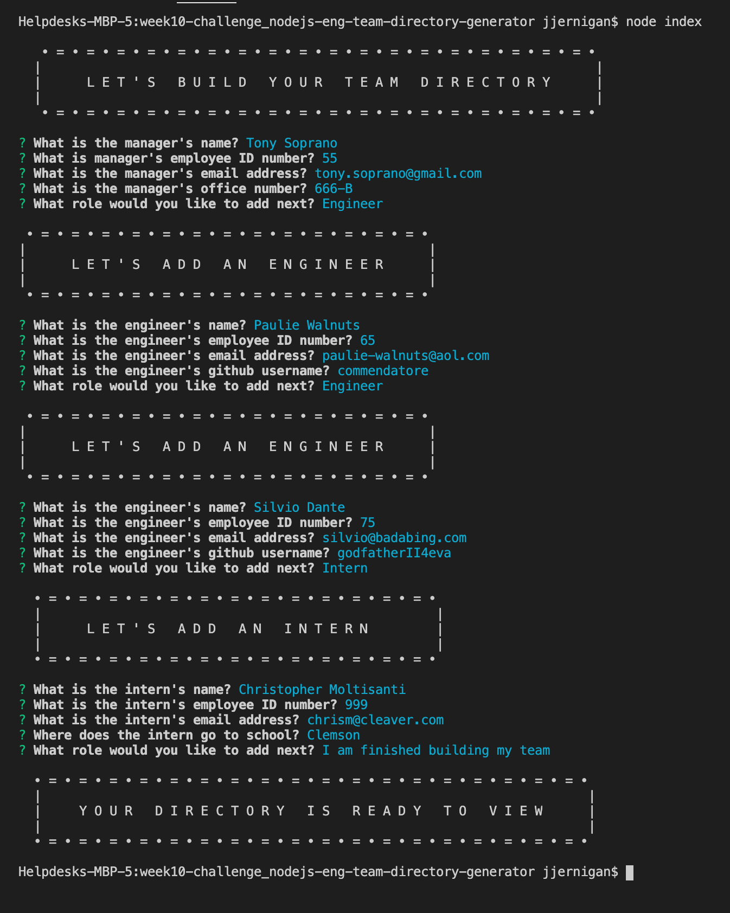
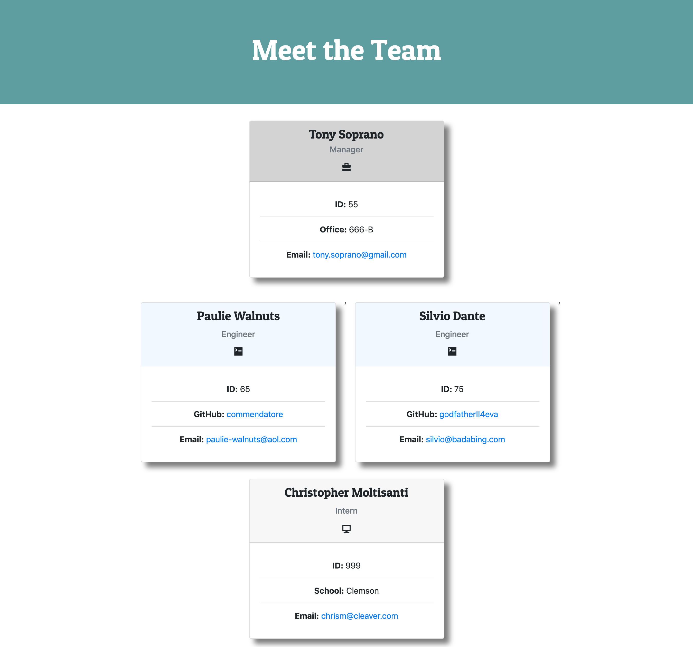

# Command-Line Engineering Team Directory Generator
  


  ## Table of Contents
  * [Description](#description)
  * [Installation](#installation)
  * [Usage](#usage)
  * [License](#license)
  * [Contribution Guidelines](#contribution-guidelines)
  * [Tests](#tests)
  * [Questions](#questions)
  


  ## Description  
  Generate a fully styled, color-coded, functional team directory right from the command-line. Each color-coded tile displays links to relevant details and contact information about each of your team members.


  ## Usage
  - Run ```node index``` to get started
  - Follow the prompts
  - Once you've added every team member, select ```'I am finished building my team'``` to exit the program
  - Open ```index.html``` in a browser to view the end result
  - Still confused? Check out [this handy tutorial.]()


  ## Contribution Guidelines
  It's chaos; be kind. 


  ## Tests  
  Run ```npm run test``` to view all unit tests.


  ## Questions
  Please direct all inquiries to [jessicajernigan](https://github.com/jessicajernigan) via email at: [jernigan.jessica.leigh@gmail.com](mailto:jernigan.jessica.leigh@gmail.com?subject=Question%20About%20Command-Line%20Engineering%20Team%20Directory%20Generator)


  
  

